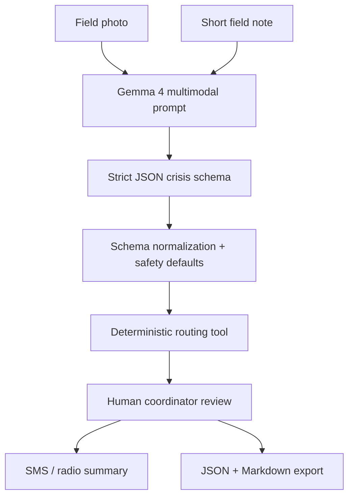

# CrisisLens architecture

## Design principle

CrisisLens deliberately separates model reasoning from operational routing.

- Gemma 4 extracts and reasons over evidence.
- The app normalizes and displays the report.
- A deterministic tool routes reports by incident type and urgency.
- A human coordinator verifies before action.

This design makes the prototype easier to audit and safer than a fully autonomous responder agent.
