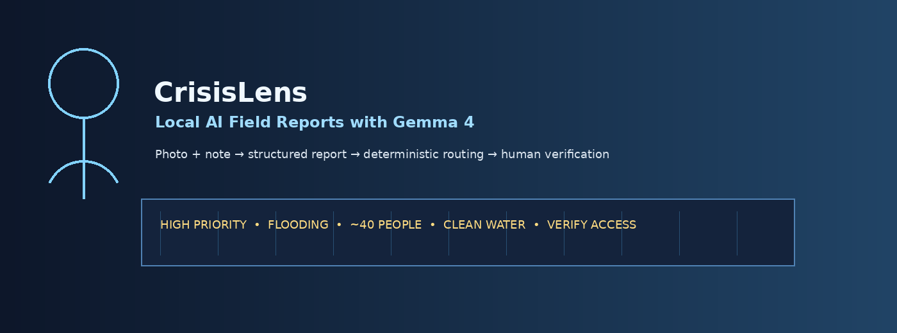

# CrisisLens — Local AI Field Reports with Gemma 4

CrisisLens turns messy field evidence — a photo plus a short note — into a structured crisis report that a human coordinator can verify, route, and forward in low-connectivity environments.

It was designed for the **Gemma 4 Good Hackathon** around one concrete workflow:

> **unstructured crisis evidence → Gemma 4 structured report → deterministic routing → SMS/radio-ready action message → human verification**



## Why it matters

During floods, fires, landslides, infrastructure failures, clinic supply gaps, and shelter operations, community teams often receive information as photos, WhatsApp messages, voice notes, or short field updates. These reports are hard to triage quickly, especially when connectivity is weak, languages vary, and the team needs a compact dispatch summary.

CrisisLens helps generate:

- incident classification
- urgency level with reasoning
- detected risks
- evidence and uncertainty
- missing questions for a dispatcher
- recommended actions
- deterministic routing recommendation
- SMS / radio-ready summary
- downloadable JSON and Markdown reports

## Why Gemma 4

CrisisLens is built to showcase Gemma 4 capabilities that matter for real-world impact:

- **Multimodal understanding:** photo + text field notes
- **Multilingual output:** English, German, Spanish, French, Arabic, Hindi, Swahili, and more depending on the model
- **Structured JSON generation:** converts model output into operational data
- **Local-first deployment:** runs through Ollama on a laptop or field workstation
- **Agentic workflow pattern:** the model proposes, deterministic tools route, humans verify

## Quick start

```bash
cd crisislens
python -m venv .venv
source .venv/bin/activate  # Windows: .venv\Scripts\activate
pip install -r requirements.txt
streamlit run app.py
```

Then open the Streamlit URL, load a sample scenario, and click **Generate crisis report**.

## Optional: run with local Gemma 4 via Ollama

Install Ollama and pull the Gemma 4 model available in your environment:

```bash
ollama pull gemma4
ollama serve
```

Then run the app:

```bash
streamlit run app.py
```

In the sidebar:

- Backend mode: `auto` or `gemma only`
- Ollama host: `http://localhost:11434`
- Ollama model: `gemma4` or the exact local model name you pulled

If Gemma is not available, `auto` mode falls back to a deterministic demo engine so the app remains presentable during recording. For the final hackathon video, use the local Gemma backend if possible and show the backend label in the UI.

## Demo workflow

1. Upload or select a disaster-response image.
2. Add a short field note, for example:

   > Bridge blocked after heavy flooding. Around 40 people are isolated near the school. No clean water since yesterday. Road access unknown.

3. Generate the report.
4. Show:
   - urgency card
   - structured dispatch report
   - risks and uncertainties
   - routing tool output
   - SMS/radio message
   - JSON/Markdown export
   - Data & prize fit tab

## Architecture

```text
Field photo + note
      ↓
Gemma 4 multimodal analysis
      ↓
Strict JSON crisis report
      ↓
Deterministic routing tool
      ↓
Human coordinator review
      ↓
SMS / radio / dispatch export
```

## Data strategy

The hackathon provides no official dataset. CrisisLens therefore includes synthetic but realistic crisis scenarios for safe, repeatable judging. This avoids exposing real victim data while still demonstrating the operational workflow.

See `data/README.md` and `data/demo_scenarios.jsonl`.

## Safety design

CrisisLens is intentionally conservative:

- It does not identify people.
- It does not make medical diagnoses.
- It preserves uncertainty.
- It asks for missing information.
- It marks every result as requiring human verification.
- It separates model analysis from deterministic routing.

## Repository structure

```text
crisislens/
  app.py                         # Streamlit app
  gemma_client.py                # Gemma/Ollama integration + fallback + routing tool
  prompts.py                     # System prompt and JSON schema
  requirements.txt
  Dockerfile
  assets/                        # synthetic demo images and banner
  data/                          # no-official-dataset strategy + demo scenarios
  demo_inputs/field_notes.csv    # batch triage examples
  sample_reports/                # generated example output
  tests/                         # lightweight router tests
  submission/                    # final copy-paste Kaggle submission material
  START_HERE_DEUTSCH.md          # German execution guide
  PRIZE_STRATEGY.md              # target-track plan
  WRITEUP_KAGGLE.md              # paste-ready Kaggle writeup draft
  VIDEO_SCRIPT.md                # 3-minute video script
  SUBMISSION_CHECKLIST.md        # final submission checklist
```

## Run tests

```bash
pytest -q
```

Expected:

```text
4 passed
```

## Kaggle submission positioning

**Primary impact track:** Global Resilience  
**Secondary impact track:** Safety & Trust  
**Special technology track:** Ollama / Local Ops, if local Gemma 4 is shown clearly in the video

**Core message:** CrisisLens helps communities transform chaotic field evidence into actionable, auditable crisis reports on local hardware, preserving privacy and working even when connectivity is limited.

## Limitations

- This is a proof-of-concept, not an official emergency-response system.
- Model outputs must be verified by trained humans.
- Visual analysis quality depends on the local Gemma 4 model used.
- The fallback engine is for demo stability only and should not be presented as the real model result.

## License

MIT License. See `LICENSE`.
